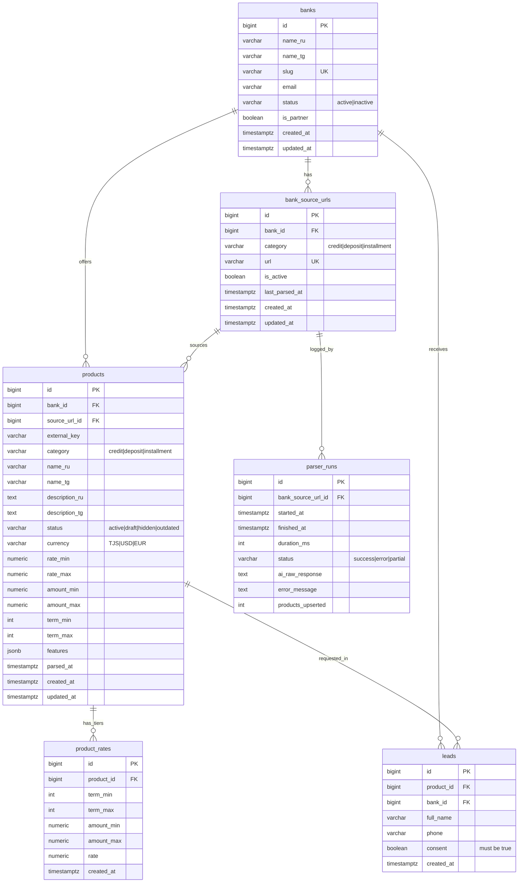

# Архитектура БД PostgreSQL — Sravni.tj

**Версия:** 1.0
**Дата:** 2026-06-05
**СУБД:** PostgreSQL 15+
**Назначение:** дизайн схемы данных (НЕ миграции). Миграции пишет отдельный агент после утверждения этого документа.

> Связанные документы: [PRD.md](../../PRD.md) (раздел «БД (PostgreSQL) — ключевые сущности»), [ТЗ.md](../../ТЗ.md), [AI-output schema](../parser/ai-output-schema.md).

---

## 0. Общие соглашения

- Имена таблиц и колонок — `snake_case`, таблицы во множественном числе.
- Первичные ключи — `BIGINT GENERATED ALWAYS AS IDENTITY` (без зависимостей от расширений; при желании можно `uuid`, но для внутреннего агрегатора `bigint` проще и быстрее в индексах).
- Временные метки — `TIMESTAMPTZ` (всегда с таймзоной), `DEFAULT now()`.
- Деньги/ставки — `NUMERIC` (точная арифметика), **не** `float`/`double`.
- Мультиязычность — пары колонок `*_ru` / `*_tg` (плоско, без отдельной таблицы переводов — на MVP два фиксированных языка, это проще для парсера и Query Builder).
- Enum-значения реализуются через **`CHECK`-ограничения по `VARCHAR`**, а не нативный `CREATE TYPE ... AS ENUM` — добавление нового значения в CHECK не требует `ALTER TYPE` и блокировок, что удобно на старте (см. §8, открытый вопрос).
- `updated_at` обновляется триггером (мигратор добавит общий trigger function) либо приложением — на усмотрение реализации.

---

## 1. Таблица `banks`

Банки-источники.

| Колонка | Тип | NULL | DEFAULT | Ограничения |
|---|---|---|---|---|
| `id` | BIGINT IDENTITY | NOT NULL | — | PK |
| `name_ru` | VARCHAR(255) | NOT NULL | — | |
| `name_tg` | VARCHAR(255) | NULL | — | хотя бы одно из name_ru/name_tg должно быть задано (CHECK) |
| `slug` | VARCHAR(120) | NOT NULL | — | UNIQUE; машинно-читаемый идентификатор (`eskhata`, `alif`) |
| `email` | VARCHAR(255) | NOT NULL | — | адрес для доставки заявок; CHECK на формат |
| `status` | VARCHAR(16) | NOT NULL | `'active'` | CHECK IN ('active','inactive') |
| `is_partner` | BOOLEAN | NOT NULL | `false` | опциональный признак партнёрства |
| `logo_url` | VARCHAR(500) | NULL | — | опционально для витрины |
| `created_at` | TIMESTAMPTZ | NOT NULL | `now()` | |
| `updated_at` | TIMESTAMPTZ | NOT NULL | `now()` | |

**CHECK:**
- `chk_banks_status`: `status IN ('active','inactive')`
- `chk_banks_name_present`: `name_ru IS NOT NULL OR name_tg IS NOT NULL`
- `chk_banks_email_format`: `email ~* '^[^@\s]+@[^@\s]+\.[^@\s]+$'`

**Индексы:**
- `uq_banks_slug` UNIQUE (`slug`)
- `idx_banks_status` (`status`) — фильтр «только активные банки» в API.

---

## 2. Таблица `bank_source_urls`

URL-источники для парсинга. Один банк → много URL по категориям (мультидомен).

| Колонка | Тип | NULL | DEFAULT | Ограничения |
|---|---|---|---|---|
| `id` | BIGINT IDENTITY | NOT NULL | — | PK |
| `bank_id` | BIGINT | NOT NULL | — | FK → banks(id) ON DELETE CASCADE |
| `category` | VARCHAR(16) | NOT NULL | — | CHECK IN ('credit','deposit','installment') |
| `url` | VARCHAR(1000) | NOT NULL | — | полный URL источника |
| `is_active` | BOOLEAN | NOT NULL | `true` | парсер берёт только активные |
| `last_parsed_at` | TIMESTAMPTZ | NULL | — | когда последний раз успешно распарсен |
| `created_at` | TIMESTAMPTZ | NOT NULL | `now()` | |
| `updated_at` | TIMESTAMPTZ | NOT NULL | `now()` | |

**CHECK:**
- `chk_bsu_category`: `category IN ('credit','deposit','installment')`

**FK:** `bank_id` → `banks(id)` **ON DELETE CASCADE** (удалили банк — ушли его источники).

**Индексы:**
- `uq_bsu_url` UNIQUE (`url`) — один URL заносится один раз.
- `idx_bsu_active` (`is_active`) WHERE `is_active = true` — partial index под основной запрос парсера `WHERE is_active = true`.
- `idx_bsu_bank` (`bank_id`).

---

## 3. Таблица `products`

Продукты (кредиты/депозиты). Денормализованные агрегаты ставки/суммы/срока для быстрых фильтров + детальная сетка в `product_rates`.

| Колонка | Тип | NULL | DEFAULT | Ограничения |
|---|---|---|---|---|
| `id` | BIGINT IDENTITY | NOT NULL | — | PK |
| `bank_id` | BIGINT | NOT NULL | — | FK → banks(id) ON DELETE CASCADE |
| `source_url_id` | BIGINT | NULL | — | FK → bank_source_urls(id) ON DELETE SET NULL |
| `external_key` | VARCHAR(255) | NOT NULL | — | стабильный ключ продукта в рамках источника (для upsert/идемпотентности) |
| `category` | VARCHAR(16) | NOT NULL | — | CHECK IN ('credit','deposit','installment') |
| `name_ru` | VARCHAR(255) | NULL | — | |
| `name_tg` | VARCHAR(255) | NULL | — | хотя бы одно задано (CHECK) |
| `description_ru` | TEXT | NULL | — | |
| `description_tg` | TEXT | NULL | — | |
| `status` | VARCHAR(16) | NOT NULL | `'draft'` | CHECK IN ('active','draft','hidden','outdated') |
| `currency` | VARCHAR(3) | NOT NULL | — | CHECK IN ('TJS','USD','EUR') |
| `rate_min` | NUMERIC(6,3) | NOT NULL | — | % годовых; CHECK 0..100 |
| `rate_max` | NUMERIC(6,3) | NOT NULL | — | CHECK 0..100, >= rate_min |
| `amount_min` | NUMERIC(18,2) | NULL | — | NULL = мин. сумма не указана; CHECK NULL OR > 0 |
| `amount_max` | NUMERIC(18,2) | NULL | — | CHECK > 0 и >= amount_min (если задан) |
| `term_min` | INTEGER | NULL | — | месяцы; CHECK > 0 |
| `term_max` | INTEGER | NULL | — | месяцы; CHECK > 0 и >= term_min (если задан) |
| `features` | JSONB | NOT NULL | `'{}'::jsonb` | булевы признаки (online_application, no_guarantor, capitalization, replenishable, early_withdrawal) |
| `parsed_at` | TIMESTAMPTZ | NULL | — | время извлечения данных AI |
| `created_at` | TIMESTAMPTZ | NOT NULL | `now()` | |
| `updated_at` | TIMESTAMPTZ | NOT NULL | `now()` | |

**CHECK:**
- `chk_products_category`: `category IN ('credit','deposit','installment')`
- `chk_products_status`: `status IN ('active','draft','hidden','outdated')`
- `chk_products_currency`: `currency IN ('TJS','USD','EUR')`
- `chk_products_rate_range`: `rate_min >= 0 AND rate_max <= 100 AND rate_max >= rate_min`
- `chk_products_amount`: `(amount_min IS NULL OR amount_min > 0) AND (amount_max IS NULL OR amount_min IS NULL OR amount_max >= amount_min)`
- `chk_products_term`: `(term_min IS NULL OR term_min > 0) AND (term_max IS NULL OR (term_max > 0 AND (term_min IS NULL OR term_max >= term_min)))`
- `chk_products_name_present`: `name_ru IS NOT NULL OR name_tg IS NOT NULL`

**FK:**
- `bank_id` → `banks(id)` **ON DELETE CASCADE**.
- `source_url_id` → `bank_source_urls(id)` **ON DELETE SET NULL** (источник могли отключить/удалить — продукт остаётся, теряет привязку).

**Идемпотентность:**
- `uq_products_source_key` UNIQUE (`source_url_id`, `external_key`) — основа upsert парсера (см. §7). Если у источника несколько одинаковых продуктов — `external_key` различает их (имя + валюта).

**Индексы под фильтры/сортировку витрины:**
- `idx_products_list` (`status`, `category`, `currency`) — основной составной индекс для `GET /api/products` (всегда фильтр по status='active' + category + валюта).
- `idx_products_rate` (`rate_min`) и `idx_products_rate_max` (`rate_max`) — сортировка/фильтр «ставка от/до». Для депозитов сортируют по `rate_max DESC` (выгоднее — выше), для кредитов по `rate_min ASC`.
- `idx_products_bank` (`bank_id`).
- `idx_products_features_gin` GIN (`features` jsonb_path_ops) — фильтры по булевым фичам (`features @> '{"online_application": true}'`).
- (Опционально) частичный `idx_products_active` (`category`, `currency`, `rate_min`) WHERE `status = 'active'` — если доля активных мала и список горячий.

---

## 4. Таблица `product_rates` — РЕКОМЕНДОВАНА (тарифная сетка)

Нормализованная сетка: строка на комбинацию диапазонов срок×сумма→ставка. Валюта наследуется от `products.currency` (одна валюта на продукт по контракту AI-схемы).

| Колонка | Тип | NULL | DEFAULT | Ограничения |
|---|---|---|---|---|
| `id` | BIGINT IDENTITY | NOT NULL | — | PK |
| `product_id` | BIGINT | NOT NULL | — | FK → products(id) ON DELETE CASCADE |
| `term_min` | INTEGER | NULL | — | месяцы; NULL = не зависит от срока; CHECK > 0 |
| `term_max` | INTEGER | NULL | — | месяцы; CHECK > 0 и >= term_min |
| `amount_min` | NUMERIC(18,2) | NULL | — | NULL = не зависит от суммы; CHECK > 0 |
| `amount_max` | NUMERIC(18,2) | NULL | — | CHECK > 0 и >= amount_min |
| `rate` | NUMERIC(6,3) | NOT NULL | — | % годовых; CHECK 0..100 |
| `created_at` | TIMESTAMPTZ | NOT NULL | `now()` | |

**CHECK:**
- `chk_rates_rate`: `rate >= 0 AND rate <= 100`
- `chk_rates_term`: `(term_min IS NULL OR term_min > 0) AND (term_max IS NULL OR (term_max > 0 AND (term_min IS NULL OR term_max >= term_min)))`
- `chk_rates_amount`: `(amount_min IS NULL OR amount_min > 0) AND (amount_max IS NULL OR (amount_max > 0 AND (amount_min IS NULL OR amount_max >= amount_min)))`

**FK:** `product_id` → `products(id)` **ON DELETE CASCADE** (удалили/перезаписали продукт — сетка пересоздаётся).

**Индексы:**
- `idx_rates_product` (`product_id`) — выборка сетки для карточки и для пересчёта агрегатов.
- `idx_rates_rate` (`rate`) — если фронт фильтрует/сортирует по конкретной ставке тарифа.
- `idx_rates_lookup` (`product_id`, `term_min`, `term_max`, `amount_min`, `amount_max`) — точечный подбор тарифа калькулятором по введённым сумме/сроку.

> Денормализованные `products.rate_min/rate_max` = `MIN/MAX(product_rates.rate)` по продукту. Поддерживаются парсером в той же транзакции (источник истины — `product_rates`).

---

## 5. Таблица `leads`

Заявки.

| Колонка | Тип | NULL | DEFAULT | Ограничения |
|---|---|---|---|---|
| `id` | BIGINT IDENTITY | NOT NULL | — | PK |
| `product_id` | BIGINT | NULL | — | FK → products(id) ON DELETE SET NULL |
| `bank_id` | BIGINT | NOT NULL | — | FK → banks(id) ON DELETE RESTRICT |
| `full_name` | VARCHAR(255) | NOT NULL | — | ФИО |
| `phone` | VARCHAR(32) | NOT NULL | — | телефон |
| `consent` | BOOLEAN | NOT NULL | — | CHECK = true (согласие обязательно) |
| `created_at` | TIMESTAMPTZ | NOT NULL | `now()` | |

**CHECK:**
- `chk_leads_consent`: `consent = true` — на уровне БД дублирует валидацию Laravel (422 без согласия), гарантия инварианта.

**FK:**
- `product_id` → `products(id)` **ON DELETE SET NULL** (продукт может быть удалён/перепарсен — заявка как факт обращения остаётся).
- `bank_id` → `banks(id)` **ON DELETE RESTRICT** (нельзя удалить банк с заявками без явного решения; заявки — бизнес-ценные данные). `bank_id` хранится явно (денормализация), т.к. заявка должна уйти на email банка даже если `product_id` обнулится.

**Индексы:**
- `idx_leads_bank` (`bank_id`).
- `idx_leads_product` (`product_id`).
- `idx_leads_created` (`created_at`) — выгрузка/аналитика по времени.

---

## 6. Таблица `parser_runs`

Метаданные запусков парсера. Пишется **только** при `PARSER_DEBUG_LOG=true`.

| Колонка | Тип | NULL | DEFAULT | Ограничения |
|---|---|---|---|---|
| `id` | BIGINT IDENTITY | NOT NULL | — | PK |
| `bank_source_url_id` | BIGINT | NULL | — | FK → bank_source_urls(id) ON DELETE SET NULL |
| `started_at` | TIMESTAMPTZ | NOT NULL | `now()` | |
| `finished_at` | TIMESTAMPTZ | NULL | — | |
| `duration_ms` | INTEGER | NULL | — | тайминг (можно вычислять из start/finish) |
| `status` | VARCHAR(16) | NOT NULL | — | CHECK IN ('success','error','partial') |
| `ai_raw_response` | TEXT | NULL | — | сырой ответ AI (для отладки галлюцинаций) |
| `error_message` | TEXT | NULL | — | текст ошибки при сбое |
| `products_upserted` | INTEGER | NULL | `0` | сколько продуктов записано в запуске |

**CHECK:**
- `chk_runs_status`: `status IN ('success','error','partial')`

**FK:** `bank_source_url_id` → `bank_source_urls(id)` **ON DELETE SET NULL** (лог переживает удаление источника).

**Индексы:**
- `idx_runs_source` (`bank_source_url_id`).
- `idx_runs_started` (`started_at`).
- `idx_runs_status` (`status`) — быстро найти упавшие запуски.

---

## 7. Решение по тарифной сетке: **Вариант A — таблица `product_rates`** ✅

**Развилка:** ставка зависит одновременно от срока × суммы × валюты (многоуровневые сетки). Хранить нормализованно (таблица `product_rates`, строка на диапазон) или как `jsonb`-массив в `products.features/rates`?

**Рекомендация: Вариант A (нормализованная таблица `product_rates`).**

### Сравнение по критериям

| Критерий | A — `product_rates` (таблица) | B — `jsonb`-массив |
|---|---|---|
| **Фильтр/сортировка «ставка от/до» через Query Builder** | Тривиально: `whereBetween('rate', ...)`, `orderBy('rate')`, обычный B-tree индекс по `rate`. Для витрины используем денормализованные `products.rate_min/rate_max` (тоже индексируемы) — **самый частый и горячий путь индексируется напрямую**. | Нужны выражения над jsonb (`jsonb_array_elements`, `@@`/`@>` или `->>` с приведением типа). Сортировка по «минимальной ставке внутри массива» требует распаковки массива на каждую строку или GIN+expression-индекс по производному значению. В Query Builder это уже `whereRaw`/`DB::raw` — нарушает требование PRD «фильтры через Query Builder без raw SQL». |
| **Индексируемость в Postgres** | Прямые B-tree по `rate`, `term`, `amount` + составные. Планировщик отлично оценивает селективность. | GIN по jsonb индексирует наличие ключей/значений, но **диапазонные** запросы (`rate <= X`) по элементам массива GIN не покрывает эффективно; нужны материализованные/expression-индексы по агрегату. Range внутри массива — слабое место. |
| **Простота записи парсером** | На продукт: upsert строки `products` + `DELETE FROM product_rates WHERE product_id=? ; INSERT ...` (replace-all сетки) в одной транзакции. Прозрачно и атомарно. | Один `UPDATE ... SET features = ?` — короче по строкам кода, но всю валидацию структуры массива несёт приложение; БД не гарантирует диапазоны элементов. |
| **Эволюция схемы** | Добавление измерения (например «способ погашения») = новая колонка/таблица с CHECK и индексом. Явно, версионируемо миграциями. | Гибко: новый ключ в объекте без миграции. Но без CHECK легко накопить «грязные» формы и рассинхрон между продуктами. |
| **Целостность данных** | CHECK на каждый диапазон и ставку на уровне БД (анти-галлюцинации усилены БД, не только парсером). | Инварианты только в приложении; БД хранит произвольный JSON. |
| **Карточка/калькулятор (точечный подбор тарифа по сумме+сроку)** | Индексируемый запрос по `(product_id, term_*, amount_*)`. | Распаковка массива в приложении или сложный jsonb-предикат. |

### Обоснование

Главный пользовательский сценарий — **«фильтр ставка от/до» + сортировка по ставке** — должен быть быстрым и индексируемым в Postgres, и это прямо требование PRD (фильтры через Laravel Query Builder, без raw SQL). Вариант A даёт это «из коробки»: горячий путь витрины обслуживается денормализованными `products.rate_min/rate_max` под обычным B-tree индексом, а детальная сетка живёт в `product_rates` для карточки и калькулятора. Вариант B загоняет любой диапазонный запрос по ставке в `whereRaw`/expression-индексы по jsonb-массивам, что и медленнее, и противоречит требованию «без raw SQL», и переносит всю гарантию корректности финансовых чисел в приложение (тогда как у нас цель — усилить анти-галлюцинации, в т.ч. CHECK-ами на уровне БД).

**Гибридность (важно):** мы НЕ отказываемся от jsonb полностью. `products.features` остаётся `jsonb` (булевы признаки — идеальный кейс для GIN `@>`), а вот **ставочная сетка** — нормализована. Это разделение «категориальные флаги → jsonb, числовые диапазоны для фильтра/сортировки → таблица+B-tree» и есть оптимум.

---

## 8. ERD



### ASCII-схема связей (кратко)

```
banks (1) ─────< bank_source_urls (N)
  │                    │
  │ (1)                │ (1)
  ▼                    ▼
products (N) >──────── source_url_id            bank_source_urls (1) ──< parser_runs (N)
  │
  │ (1)
  ▼
product_rates (N)

banks (1) ──< leads (N) >── (1) products      (leads.bank_id денормализован, NOT NULL)
```

---

## 9. Транзакционная запись парсером (upsert + идемпотентность)

Парсер пишет напрямую в БД. На один продукт со страницы — одна транзакция:

1. **BEGIN.**
2. **Upsert продукта** по уникальному ключу идемпотентности `(source_url_id, external_key)`:
   ```
   INSERT INTO products (bank_id, source_url_id, external_key, category, name_ru, name_tg,
                         description_ru, description_tg, currency,
                         rate_min, rate_max, amount_min, amount_max, term_min, term_max,
                         features, status, parsed_at, created_at, updated_at)
   VALUES (...)
   ON CONFLICT (source_url_id, external_key) DO UPDATE SET
       name_ru = EXCLUDED.name_ru, ..., rate_min = EXCLUDED.rate_min, rate_max = EXCLUDED.rate_max,
       features = EXCLUDED.features, parsed_at = EXCLUDED.parsed_at, updated_at = now()
   RETURNING id;
   ```
   - `external_key` = стабильный ключ продукта внутри источника (нормализованное `name_ru` + `currency`). Делает повторный парсинг **идемпотентным**: тот же продукт обновляется, а не дублируется.
   - `status` при upsert **не перетирается** автоматически на `active` — политика статуса решается отдельно (см. открытый вопрос §10.1). По умолчанию новый продукт = `draft` или `active` согласно решению.
3. **Replace-all тарифной сетки** (источник истины — `rate_tiers` из AI):
   ```
   DELETE FROM product_rates WHERE product_id = :id;
   INSERT INTO product_rates (product_id, term_min, term_max, amount_min, amount_max, rate) VALUES ...;
   ```
   `ON DELETE CASCADE` на FK страхует от сирот; replace-all проще диффа и атомарен в транзакции.
4. **Пересчёт денормализованных агрегатов** `products.rate_min/rate_max` из вставленной сетки (если сетка непуста):
   ```
   UPDATE products SET rate_min = (SELECT MIN(rate) FROM product_rates WHERE product_id = :id),
                       rate_max = (SELECT MAX(rate) FROM product_rates WHERE product_id = :id)
   WHERE id = :id;
   ```
5. **COMMIT.**
6. При `PARSER_DEBUG_LOG=true` — отдельной записью (вне или после основной транзакции) лог в `parser_runs` с таймингами, статусом, `ai_raw_response`, `products_upserted`.

**Идемпотентность гарантируется** уникальным индексом `(source_url_id, external_key)` + `ON CONFLICT DO UPDATE`. Повторный прогон одного URL не плодит дубликаты.

**Устаревание (outdated):** опционально — продукты источника, не встреченные в текущем прогоне, можно пометить `status = 'outdated'` запросом «не обновлялись в этом run» (по `parsed_at < run_started_at AND source_url_id = :sid`). Это решение по политике (см. §10).

---

## 10. Открытые вопросы для утверждения (до миграций)

1. **Стартовый `status` распарсенного продукта:** `draft` (требует ручного перевода в `active` — но админки нет) или сразу `active` (публикуется без ревью, как заявлено в ТЗ «без ручного ревью»)? Влияет на upsert парсера. **Рекомендация:** `active` при успешной валидации, т.к. админки/ревью на MVP нет; `draft` теряет смысл без интерфейса перевода.
2. **Авто-`outdated`:** помечать ли продукты, исчезнувшие со страницы банка, статусом `outdated` автоматически в конце прогона? Нужна ли политика «N неудачных прогонов → outdated»?
3. **Enum через CHECK vs нативный `ENUM` type:** документ предлагает `VARCHAR + CHECK` (проще эволюция). Если команда предпочитает строгие нативные `ENUM` Postgres — нужно подтвердить (повлияет на миграции и на маппинг в Laravel/Go).
4. **`external_key` для идемпотентности:** подтвердить формулу стабильного ключа продукта (`normalize(name) + currency`?). Если банки переименовывают продукты между прогонами — ключ «поплывёт» и появятся дубли; возможно, нужен более устойчивый признак (URL продукта/якорь на странице).
5. **PII в `leads` и retention:** телефон/ФИО — персональные данные. Нужна ли политика хранения/удаления (срок жизни заявки), шифрование/маскирование, и подтверждение, что `consent = true` на уровне БД (CHECK) — желаемый жёсткий инвариант. `bank_id` в `leads` сделан `ON DELETE RESTRICT` — подтвердить, что банк с заявками нельзя удалять.
