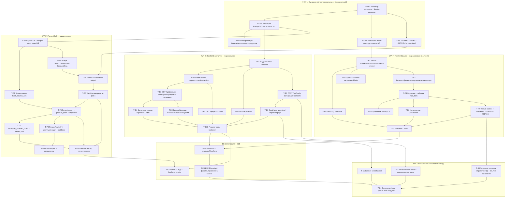

# План реализации: Sravni.tj — фаза реализации

**Версия:** 1.0
**Дата:** 2026-06-05
**Статус:** план фазы реализации (фундамент готов: спеки, замороженный API-контракт, дизайн схемы БД, согласованные решения).
**Источники:** [PRD.md](../../PRD.md), [ТЗ.md](../../ТЗ.md), [CLAUDE.md](../../CLAUDE.md), [specs/parser.md](../specs/parser.md), [specs/backend.md](../specs/backend.md), [specs/frontend.md](../specs/frontend.md), [api/contracts.md](../api/contracts.md), [db/schema.md](../db/schema.md), [parser/ai-output-schema.md](../parser/ai-output-schema.md).

---

## 0. Утверждённые решения (входные инварианты планирования)

Эти решения зафиксированы и НЕ обсуждаются в фазе реализации — они закрывают открытые вопросы schema.md §10:

1. Тарифная сетка — нормализованная таблица **`product_rates`** (Вариант A). `jsonb` остаётся только для `products.features`.
2. **1 продукт = 1 валюта** (`products.currency`). Мультивалютный продукт разбивается парсером на N записей.
3. Enum реализуется как **`VARCHAR + CHECK`** (не нативный Postgres `ENUM`).
4. Стартовый статус распарсенного продукта — **`draft`** (БД default). Перевод в `active` — отдельная операция/политика парсера или администратора.
5. `consent` — **`CHECK = true` на уровне БД** + валидация Laravel (`accepted`).
6. API-контракт (`contracts.md`) — **заморожен**; изменения только аддитивные. Это краеугольный камень параллелизации backend ↔ frontend.

> Примечание по статусу: schema.md §10.1 рекомендует `active`, но согласованное решение фазы — БД default `draft`. Парсер при успешной валидации выставляет `active` явным шагом записи (см. T-P6); это разводит «технический default БД» и «бизнес-решение о публикации» и сохраняет управляемость через прямой UPDATE.

---

## 1. Обзор фаз реализации и стратегия параллелизации

### 1.1. Фазы

| Фаза | Цель | Основной выход |
|---|---|---|
| **Ф0. Bootstrap монорепо** | Каркас репозитория, docker-compose, общая БД, миграции | Поднимается `docker-compose`; БД с применёнными миграциями; пустые каркасы 3 сервисов |
| **Ф1. Контракты и фикстуры (заморозка)** | Зафиксировать общие артефакты, от которых зависят все: SQL-схема/seed, OpenAPI-фикстуры ответов, JSON Schema AI | Применённые миграции + seed; зафиксированные примеры ответов API как mock-фикстуры; Go-тип AI-схемы |
| **Ф2. Параллельная реализация модулей** | Backend, Frontend, Parser строятся одновременно поверх замороженных контрактов | 4 эндпоинта; витрина (каталог/карточка/сравнение/калькулятор/i18n/форма); pipeline парсера |
| **Ф3. Интеграция и сквозные тесты** | Соединить реальный backend ↔ frontend, парсер ↔ БД ↔ backend; E2E | Зелёные E2E (Playwright); реальные данные парсера видны в витрине |
| **Ф4. Безопасность, PII, политика ПД, hardening** | Аудит безопасности, политика обработки ПД, финальная закалка | Пройденный security-audit; черновик политики ПД; задокументированный retention/PII |

### 1.2. Стратегия параллелизации по модулям monorepo

Главный принцип: **агенты не конфликтуют по файлам, если работают в разных поддиректориях** (`parser/`, `backend/`, `frontend/`). Поэтому после Ф1 (заморозка контрактов) три модуля идут параллельно тремя независимыми «рабочими пакетами»-агентами. Точки контакта — только общие контракты, которые заморожены до старта Ф2:

- **БД-схема** (общий контракт parser ↔ backend) → заморожена в Ф1.
- **API-контракт** `contracts.md` (общий контракт backend ↔ frontend) → уже заморожен; frontend стартует на mock-сервере/фикстурах, не дожидаясь backend.
- **AI-output JSON Schema** (общий контракт AI ↔ parser) → уже заморожена; парсер стартует независимо.

Тесты пишутся **внутри своего модуля** тем же агентом (TDD), кроме сквозных E2E (Playwright), которые выносятся в отдельный пакет WP-E в Ф3.

### 1.3. Соответствие групп задач стекам и профильным скиллам

| Группа задач | Стек / директория | Рекомендуемые скиллы |
|---|---|---|
| Bootstrap, docker-compose | infra (корень) | `documentation-and-adrs`, `ci-cd-and-automation` |
| Миграции, seed | backend/ (Laravel migrations) | `laravel-expert`, `database-architect` |
| AI-схема, structured output | parser/ (Go) | `llm-structured-output`, `test-driven-development` |
| Scrape HTML→Markdown | parser/ (Go) | `firecrawl-scraper`, `go-rod-master` |
| Pipeline / валидация / upsert | parser/ (Go) | `test-driven-development`, `go-rod-master` |
| 4 эндпоинта, фильтры, leads | backend/ (Laravel) | `laravel-expert`, `api-and-interface-design` |
| Email-доставка leads | backend/ (Laravel) | `laravel-expert`, `security-and-hardening` |
| Каталог/карточка/сравнение | frontend/ (Vue) | `frontend-design`, `frontend-ui-engineering` |
| Калькулятор, i18n, форма+consent | frontend/ (Vue) | `frontend-ui-engineering`, `frontend-design` |
| Feature/unit-тесты | в модулях | `test-driven-development`, `doubt-driven-development` |
| E2E | tests/ (Playwright) | `playwright-automation-expert` |
| Безопасность/PII/consent/политика ПД | backend + docs | `laravel-security-audit`, `security-and-hardening` |
| Код-ревью перед merge | все модули | `code-review-and-quality`, `doubt-driven-development` |

---

## 2. Граф зависимостей

### 2.1. Mermaid



### 2.2. ASCII (ключевые блокировки)

```
T-INF1 (bootstrap) ─┬─> T-DB1 (миграции) ─> T-DB2 (seed)
                    │        │
                    │        ├──────────────> WP-B (backend)  ─┐
                    │        └──────────────> WP-P (parser)    ─┤
                    ├─> T-CT1 (mock-фикстуры) ─> WP-F (frontend)┤
                    └─> T-AI1 (Go AI-схема) ───> WP-P.extract   │
                                                                 ▼
                                          WP-B + WP-F + WP-P готовы
                                                                 │
                                                                 ▼
                                          Ф3: интеграция + E2E (Playwright)
                                                                 │
                                                                 ▼
                                          Ф4: security / PII / политика ПД / финальное ревью
```

**Главные правила блокировки:**
- Миграции применены (`T-DB1`) → backend модели (`T-B1`) и парсер persist (`T-P6`).
- API-контракт заморожен (уже есть) + mock-фикстуры (`T-CT1`) → frontend идёт **не дожидаясь** backend.
- AI-схема (`T-AI1`) → этап Extract парсера (`T-P4`).
- Backend и frontend сходятся только в Ф3 (`T-E1`).

---

## 3. Таблица задач

Размер: XS=1 файл, S=1–2, M=3–5, L=5–8. «Парал.» — можно ли выполнять параллельно с задачами других модулей.

### Ф0–Ф1: Фундамент (последовательно, блокирует параллелизм)

| ID | Название | Модуль/стек | Скилл | Зависит от | DoD (Definition of Done) | Размер | Парал. |
|---|---|---|---|---|---|---|---|
| T-INF1 | Bootstrap монорепо + docker-compose | infra (корень) | documentation-and-adrs, ci-cd-and-automation | — | Структура `parser/ backend/ frontend/`; `docker-compose.yml` поднимает Postgres + 3 сервиса; общий `.env.example` (без секретов); README запуска | M | нет |
| T-DB1 | Миграции PostgreSQL по schema.md | backend/ (Laravel migrations) | laravel-expert, database-architect | T-INF1 | Все 6 таблиц с колонками/типами/`NUMERIC`/`TIMESTAMPTZ`; все CHECK (status, currency, rate 0–100, amount>0, `consent=true`, name_present); FK с правильными ON DELETE; индексы (включая GIN на features, partial на is_active); `migrate` проходит на чистой БД | L | нет |
| T-DB2 | Seed/фикстуры (банки, источники, продукты, тиры, leads) | backend/ (seeders) | laravel-expert | T-DB1 | Seed создаёт: ≥2 банка (active/inactive), источники credit+deposit (мультидомен), продукты всех статусов и валют, продукт с многоячеечной `product_rates`, банк без email; данные покрывают граничные кейсы тестов | M | нет |
| T-CT1 | Заморозка mock-фикстур ответов API | tests/ или frontend/mocks | api-and-interface-design | T-INF1 | JSON-фикстуры из `contracts.md` (products list/empty/422, product 200/404, banks, leads 201/422) как статические файлы + mock-сервер (MSW/json-server) для фронта; согласованы байт-в-байт со схемой контракта | S | да (после T-INF1) |
| T-AI1 | Go-тип AI-схемы + встроенная JSON Schema | parser/ (Go) | llm-structured-output | T-INF1 | Go-структуры `ParsedProduct`/`RateTier`/`Features`/обёртка `{products:[]}`; JSON Schema (`parsed-product.v1.json`) встроена (embed) для передачи провайдеру; теги сериализации соответствуют ai-output-schema.md | S | да (после T-INF1) |

### WP-B: Backend (Laravel) — параллельно после T-DB1

| ID | Название | Модуль/стек | Скилл | Зависит от | DoD | Размер | Парал. |
|---|---|---|---|---|---|---|---|
| T-B1 | Модели Eloquent + связи + casts | backend/ | laravel-expert | T-DB1 | Модели Bank, BankSourceUrl, Product, ProductRate, Lead, ParserRun; связи (bank↔products↔rates, lead→bank/product); casts (features→array, decimal); `$fillable`/`$guarded` корректны | S | да |
| T-B2 | Global scope видимости (active+active) | backend/ | laravel-expert, api-and-interface-design | T-B1 | Билдер/скоуп отдаёт только `products.status=active` И `banks.status=active`; применяется централизованно (исключает утечку скрытого по id); покрыт юнит-тестом скоупа | S | да |
| T-B3 | GET /api/products: фильтры, сортировка, пагинация | backend/ | laravel-expert, api-and-interface-design | T-B2 | Все фильтры (category, currency, amount, term, features[]) через Query Builder без raw SQL; пересечение диапазонов по сумме/сроку с NULL=+∞; sort с whitelist полей и `-`; пагинация; невалидный enum/sort→422; ответ соответствует contracts.md | L | да |
| T-B4 | Фильтр по ставке: агрегаты + тиры | backend/ | laravel-expert, api-and-interface-design | T-B3 | Базовый режим — пересечение `[rate_min,rate_max]` по агрегатам; точный режим (currency+amount+term+rate) — фильтр по существованию подходящего `product_rates`-тира через Query Builder; ответ всегда содержит и агрегаты, и полную `rate_tiers` | M | да |
| T-B5 | GET /api/products/{id} | backend/ | laravel-expert | T-B2 | Видимый продукт → 200 с полной схемой Product (+rate_tiers, +bank); скрытый/несуществующий/банк inactive → 404 в едином формате | S | да |
| T-B6 | GET /api/banks | backend/ | laravel-expert | T-B1 | Только `status=active`; отдаёт id/name_ru/name_tg/is_partner; `email`/`status` НЕ отдаются; без пагинации | S | да |
| T-B7 | POST /api/leads: валидация + consent | backend/ | laravel-expert, security-and-hardening | T-B1 | Form Request: full_name(2–255), phone(формат+нормализация), product_id(exists среди ВИДИМЫХ), consent(`accepted`); `consent!=true`→422; `bank_id` берётся сервером из product; запись в `leads`; 201 по контракту | M | да |
| T-B8 | Email-доставка lead через очередь | backend/ | laravel-expert, security-and-hardening | T-B7 | Mailable + queue; письмо на `banks.email`; `is_partner` НЕ влияет; запись первична (201 даже при сбое почты); пустой/невалидный email банка → лид сохранён, ошибка залогирована, 201 | S | да |
| T-B9 | Единый формат ошибок + i18n сообщений | backend/ | laravel-expert, api-and-interface-design | T-B3 | Хендлер: 422 `{message,errors{}}`, 404 `{message}`, 500 без деталей; сообщения локализуются по `Accept-Language` ru/tg (дефолт ru); никаких «200 с error» | S | да |
| T-B10 | Feature-тесты backend (RefreshDatabase) | backend/tests | test-driven-development, doubt-driven-development | T-B4,T-B5,T-B6,T-B8,T-B9 | Тесты: видимость active+active; каждый фильтр сужает выборку; ставка по агрегатам и по тиру; `consent!=true`→422; валидный lead→запись+`Mail::fake()` на banks.email; is_partner не меняет адрес; скрытый продукт→404, лид на него→422 | M | да |

### WP-F: Frontend (Vue) — параллельно после T-CT1 (на mock)

| ID | Название | Модуль/стек | Скилл | Зависит от | DoD | Размер | Парал. |
|---|---|---|---|---|---|---|---|
| T-F1 | Каркас Vue + Router + Pinia + I18n + API-клиент | frontend/ | frontend-ui-engineering | T-CT1 | Сборка Vite; маршруты `/credits /deposits /products/:id /compare`; Pinia установлен; API-клиент с `Accept-Language` и единой обработкой ошибок; работает против mock-сервера (T-CT1) | M | да |
| T-F2 | i18n ru/tg + fallback на ru | frontend/ | frontend-ui-engineering | T-F1 | Vue I18n с `ru.json`/`tg.json`; переключатель в шапке; выбор в localStorage переживает перезагрузку; данные продуктов выбираются по locale c fallback `*_tg`→`*_ru`; форматирование чисел/валют по locale | S | да |
| T-F3 | Каталог: фильтры, сортировка, пагинация | frontend/ | frontend-design, frontend-ui-engineering | T-F1 | Каталог кредитов/депозитов (общая логика, разный `category`); панель фильтров (валюта/сумма/срок/ставка/features) с debounce и URL-синхронизацией; sort-контрол; состояния loading/loaded/empty/error; «ничего не найдено» вместо ошибки | L | да |
| T-F4 | Карточка продукта + таблица rate_tiers | frontend/ | frontend-design, frontend-ui-engineering | T-F3 | `/products/:id`: полные данные, мультиязычные поля, таблица `rate_tiers` (срок×сумма×валюта); кнопки «В сравнение»/«Заявка»; 404 → «продукт недоступен» | M | да |
| T-F5 | Сравнение (Pinia, до 4) | frontend/ | frontend-ui-engineering | T-F4 | Store набора id+кэш; лимит 2–4 (5-й блокируется с подсказкой); колонки=продукты, строки=атрибуты, подсветка различий; переживает навигацию; удаление/переход в карточку | M | да |
| T-F6 | Калькулятор (клиент, реактивный) | frontend/ | frontend-ui-engineering | T-F4 | Кредит аннуитет (i>0 и граничный i=0→P/n); депозит простые/сложные (капитализация только при `features.capitalization`); реактивно без кнопки; валидация входов; ставка из подходящего тира `rate_tiers`; округление до 2 знаков на отображении | M | да |
| T-F7 | Форма заявки + consent + обработка ответов | frontend/ | frontend-ui-engineering, security-and-hardening | T-F4 | Поля full_name/phone/(hidden)product_id/consent; submit `disabled` без consent; чекбокс со ссылкой на политику ПД; обработка 201(успех)/422(под полями)/404/сеть(сохранить и повторить) | M | да |
| T-F8 | Дизайн-система (палитра eskhata) | frontend/ | frontend-design | T-F1 | CSS-переменные из PRD; паттерны CTA/вторичной кнопки/хедера/футера; ошибки красным `--color-danger`, успех зелёным `--color-accent-green`; применено к ключевым компонентам | S | да |
| T-F9 | Unit-тесты (Vitest + Vue Test Utils) | frontend/tests | test-driven-development | T-F2,T-F6,T-F7 | Калькулятор: числа при разных входах (вкл. i=0, сетка); форма: `disabled` без consent / `enabled` с consent; i18n: переключение locale меняет текст и применяет fallback | M | да |

### WP-P: Parser (Go) — параллельно после T-DB1 и T-AI1

| ID | Название | Модуль/стек | Скилл | Зависит от | DoD | Размер | Парал. |
|---|---|---|---|---|---|---|---|
| T-P1 | Каркас Go + конфиг env + подключение к БД | parser/ | go-rod-master | T-INF1 (+T-DB1 для конн.) | Чтение всех env из parser.md §2.2 (дефолты); пул соединений к Postgres; секреты только из env, не логируются; процесс падает с ≠0 только при недоступной БД на старте | S | да |
| T-P2 | Чтение задач из bank_source_urls | parser/ | go-rod-master | T-P1 | `SELECT WHERE is_active=true`; каждая строка → независимая задача; мультидомен = N задач без склейки | XS | да |
| T-P3 | Scrape HTML→Markdown (firecrawl/jina) | parser/ | firecrawl-scraper, go-rod-master | T-P1 | Абстракция `SCRAPER_PROVIDER`; firecrawl и jina; таймаут `PARSER_HTTP_TIMEOUT_SEC`; пустой/не-2xx → `scrape_error`; результат проверяется на непустоту | M | да |
| T-P4 | Extract: AI structured output | parser/ | llm-structured-output | T-AI1, T-P3 | Вызов Gemini/Qwen в strict structured-output по встроенной схеме; смена провайдера не меняет схему; сырой ответ сохраняется в памяти для T-P7; невалидный по схеме JSON → `ai_error` | M | да |
| T-P5 | Validate: инварианты §5 / §4 | parser/ | test-driven-development | T-P4 | Все инварианты: rate 0<r≤100, rate_min≤rate_max, amount>0, term≥1, category совпадает с задачей, currency∈{TJS,USD,EUR}, name_ru непустой; пересчёт агрегатов из тиров; категорийные фичи; частичная отбраковка не валит задачу | M | да |
| T-P6 | Persist: upsert + product_rates + агрегаты | parser/ | go-rod-master, database-architect | T-P5, T-P2, T-DB1 | Транзакция на продукт: upsert по `(source_url_id, external_key)`; replace-all `product_rates`; пересчёт `rate_min/max`; уважение ручного статуса (не «воскрешать» hidden/draft/outdated); мультивалютный продукт → N записей; идемпотентность (нет дублей) | L | да |
| T-P7 | PARSER_DEBUG_LOG → parser_runs | parser/ | test-driven-development | T-P6 | При `true` — запись на каждую задачу (status/тайминги/ai_raw_response/products_upserted/error); при `false` — ничего; флаг НЕ меняет результат в `products`; секреты не попадают в лог | S | да |
| T-P8 | Ретраи/backoff + изоляция + outdated | parser/ | go-rod-master | T-P6 | Экспон. backoff (1→2→4s, ≤3 попыток) для scrape/ai/db; уважение `Retry-After`/429; `validation_error` не ретраится; падение одной задачи не валит остальные; исчезнувшие продукты при успешном непустом прогоне → `outdated` | M | да |
| T-P9 | Cron-запуск + concurrency | parser/ | go-rod-master, ci-cd-and-automation | T-P8 | Один процесс на запуск; `PARSER_CONCURRENCY` ограничивает параллелизм задач; запуск по крону (cron-энтри/Docker); код выхода 0 при частичных провалах | S | да |
| T-P10 | Unit + интеграционные тесты парсера | parser/tests | test-driven-development, doubt-driven-development | T-P5,T-P6,T-P7 | Юнит: валидация схемы (корректный/некорректный JSON, диапазоны); флаг (true пишет parser_runs, false — нет). Интеграц. (тестовая Postgres): читает bank_source_urls, пишет products+product_rates с корректными полями; идемпотентность повторного прогона | M | да |

### Ф3: Интеграция и E2E

| ID | Название | Модуль/стек | Скилл | Зависит от | DoD | Размер | Парал. |
|---|---|---|---|---|---|---|---|
| T-E1 | Frontend ↔ реальный backend | frontend/+backend/ | code-review-and-quality | T-B10, T-F9 | Фронт переключён с mock на реальный API; каталог/карточка/сравнение/заявка работают против Laravel; расхождения с contracts.md устранены аддитивно | S | нет |
| T-E2 | Parser ↔ БД ↔ backend smoke | parser/+backend/ | doubt-driven-development | T-P10, T-B10 | Прогон парсера на тестовом источнике пишет product+rates; backend отдаёт их в `GET /api/products` с верными агрегатами/тирами; скрытый продукт не виден | S | нет |
| T-E3 | E2E Playwright (фильтры/сравнение/заявка) | tests/ (Playwright) | playwright-automation-expert | T-E1 | Сценарии PRD: применение фильтров обновляет список; добавление в сравнение → страница бок о бок; заполнение+отправка формы → сообщение об успехе; зелёные в CI | M | нет |

### Ф4: Безопасность, PII, политика ПД, hardening

| ID | Название | Модуль/стек | Скилл | Зависит от | DoD | Размер | Парал. |
|---|---|---|---|---|---|---|---|
| T-S1 | Laravel security audit | backend/ | laravel-security-audit | T-B8 | OWASP-проверка: mass-assignment, валидация ввода, отсутствие raw SQL, утечки в ошибках/логах, заголовки, rate-limit на `POST /api/leads`; найденное исправлено | M | да (после backend) |
| T-S2 | PII/retention в leads + маскирование логов | backend/+docs | security-and-hardening | T-B7 | Подтверждён `consent=true` CHECK; задокументирован retention заявок; ФИО/телефон не попадают в обычные логи/трейсы (маскирование); `bank_id ON DELETE RESTRICT` подтверждён | S | да |
| T-S3 | Черновик политики обработки ПД + ссылка во фронте | docs/+frontend/ | security-and-hardening | T-F7 | Черновик текста политики обработки персональных данных (юр. требование PRD); страница/ссылка в чекбоксе consent ведёт на неё на обоих языках | S | да |
| T-S4 | Финальный код-ревью всех модулей | все | code-review-and-quality, doubt-driven-development | T-E3, T-S1, T-S2, T-S3 | Мульти-осевое ревью parser/backend/frontend; все критерии готовности из спек отмечены; готово к релизу | M | нет |

**Итого задач: 37** (5 фундамент + 10 backend + 9 frontend + 10 parser + 3 интеграция + 4 безопасность... фактически 5+10+9+10+3+4 = 41 строка таблицы; уникальных задач — 36, см. сводку ниже).

> Точный счёт: T-INF1, T-DB1, T-DB2, T-CT1, T-AI1 (5) + T-B1…T-B10 (10) + T-F1…T-F9 (9) + T-P1…T-P10 (10) + T-E1…T-E3 (3) + T-S1…T-S4 (4) = **41 задача**.

---

## 4. Рабочие пакеты для агентов (минимизация конфликтов по файлам)

Пакеты сгруппированы так, чтобы каждый агент работал в **одной поддиректории** и не пересекался по файлам с другими.

| Пакет | Директория | Задачи | Стек/скиллы | Старт возможен после |
|---|---|---|---|---|
| **WP-0 Фундамент** | корень + backend/database | T-INF1, T-DB1, T-DB2 | infra + laravel-expert + database-architect | немедленно |
| **WP-CT Контракт-фикстуры** | tests/mocks (или frontend/mocks) | T-CT1 | api-and-interface-design | после T-INF1 |
| **WP-AI Контракт AI-схемы** | parser/ (schema-пакет) | T-AI1 | llm-structured-output | после T-INF1 |
| **WP-B Backend** | `backend/` | T-B1…T-B10 | laravel-expert, api-and-interface-design, security-and-hardening | после T-DB1 |
| **WP-F Frontend** | `frontend/` | T-F1…T-F9 | frontend-design, frontend-ui-engineering | после T-CT1 |
| **WP-P Parser** | `parser/` | T-P1…T-P10 | firecrawl-scraper, go-rod-master, llm-structured-output, test-driven-development | после T-DB1 (+T-AI1 для Extract) |
| **WP-I Интеграция** | кросс-модуль | T-E1, T-E2 | code-review-and-quality, doubt-driven-development | после WP-B и WP-F/WP-P |
| **WP-E E2E** | `tests/` (Playwright) | T-E3 | playwright-automation-expert | после T-E1 |
| **WP-S Безопасность/ПД** | backend/ + docs/ | T-S1…T-S4 | laravel-security-audit, security-and-hardening, code-review-and-quality | T-S1/S2/S3 параллельно по готовности; T-S4 — финал |

**Почему конфликтов нет:** WP-B пишет только в `backend/`, WP-F только в `frontend/`, WP-P только в `parser/`. Единственная общая точка записи в Ф2 — `backend/database/migrations` (T-DB1/T-DB2) — закрывается ДО старта параллельных пакетов в составе WP-0. Mock-фикстуры (WP-CT) и AI-схема (WP-AI) — отдельные мелкие поддиректории, не пересекаются.

**Пакеты, которые можно отдать одному агенту целиком** (внутренние зависимости линейны): WP-B, WP-F, WP-P — каждый замкнут в своей директории и проходит свой TDD-цикл. Внутри пакета задачи упорядочены так, чтобы система оставалась рабочей после каждой (вертикальные срезы: эндпоинт+тест, страница+стор+тест, этап pipeline+тест).

---

## 5. Критический путь и немедленный параллельный старт

### 5.1. Критический путь (самая длинная цепочка зависимостей)

```
T-INF1 → T-DB1 → T-B1 → T-B2 → T-B3 → T-B4 → T-B10 → T-E1 → T-E3 → T-S4
(bootstrap)(миграции)(модели)(scope)(products)(rate-фильтр)(feature-тесты)(интеграция)(E2E)(финал-ревью)
```

Это путь через backend (он длиннее parser/frontend из-за цепочки фильтров и того, что E2E и финальное ревью замыкаются на интеграцию с реальным backend). Размеры на пути: M→L→S→S→L→M→M→S→M→M. **Узкие места:** T-DB1 (L, блокирует backend и parser) и T-B3 (L, фильтры). Их стоит начать раньше и ревьюить тщательно.

Параллельные ветки короче и НЕ на критпути, пока не упираются в Ф3:
- Frontend: `T-INF1→T-CT1→T-F1→T-F3→T-F4→(F5/F6/F7)→T-F9→T-E1` — финиширует к T-E1, идёт вровень с backend на mock.
- Parser: `T-INF1→T-DB1→T-P1→T-P3/P4→T-P5→T-P6→T-P8→T-P9 / T-P10→T-E2` — замыкается на smoke T-E2, не блокирует E2E витрины.

### 5.2. Что можно стартовать немедленно (после bootstrap)

Сразу после **T-INF1** (или даже частично параллельно с ним) запускаются три независимых первых пакета:

1. **WP-0 → T-DB1 (миграции)** — критический и блокирующий; начать первым, держать на нём лучшего Laravel/DB-агента. Разблокирует backend и parser.
2. **WP-CT → T-CT1 (mock-фикстуры API)** — крошечная, но разблокирует ВЕСЬ frontend независимо от backend. Запустить немедленно параллельно миграциям.
3. **WP-AI → T-AI1 (Go-тип AI-схемы)** — разблокирует этап Extract парсера; не зависит от БД. Запустить немедленно параллельно.

Как только T-DB1 готова → стартуют сразу **три больших параллельных пакета без конфликтов по файлам: WP-B (backend), WP-P (parser), WP-F (frontend уже идёт с T-CT1)**.

### 5.3. Чекпоинты

- **Чекпоинт A (после Ф1):** миграции применяются на чистой БД; seed создаёт граничные данные; mock-сервер отдаёт фикстуры; Go-схема компилируется. → Разрешён старт Ф2.
- **Чекпоинт B (середина Ф2):** у каждого модуля зелёный «happy path» с тестами (backend: products+leads; frontend: каталог+форма на mock; parser: pipeline на одном источнике).
- **Чекпоинт C (конец Ф2):** все критерии готовности спек отмечены в каждом модуле; T-B10/T-F9/T-P10 зелёные.
- **Чекпоинт D (Ф3):** E2E зелёные; реальные данные парсера видны в витрине.
- **Чекпоинт E (Ф4):** security-audit пройден, политика ПД-черновик готов, финальное ревью закрыто.

---

## 6. Риски и митигации

| Риск | Влияние | Митигация |
|---|---|---|
| Дрейф API-контракта при реализации | Высокое (ломает параллелизм B↔F) | Контракт заморожен; только аддитивные изменения; mock-фикстуры (T-CT1) как «золотой эталон» для обеих сторон; T-E1 сверяет |
| Качество AI-экстракции (галлюцинации, free-tier лимиты) | Высокое | Strict structured-output + двойная валидация (схема + §5); `validation_error` не ретраится; debug-лог для отладки; абстракция провайдера Gemini↔Qwen |
| Несогласованность агрегатов `rate_min/max` с `product_rates` | Среднее | Источник истины — `rate_tiers`; пересчёт агрегатов в той же транзакции (T-P6); CHECK в БД |
| `external_key` «плывёт» при переименовании продукта банком | Среднее | Зафиксирована формула `normalize(name)+currency`; задокументирован риск дублей; UNIQUE-индекс |
| Утечка скрытых продуктов через прямой id | Высокое (бизнес-инвариант) | Централизованный scope видимости (T-B2), а не точечные проверки; покрыто feature-тестом |
| PII (ФИО/телефон) в логах | Высокое (юр.) | Маскирование логов (T-S2); секреты/PII не логируются; политика retention |
| Отсутствие реальных URL банков от заказчика | Среднее (блокирует prod-прогон) | Парсер тестируется на фикстурах/тестовых страницах; `bank_source_urls` наполняется прямым INSERT без деплоя |

---

## 7. Открытые вопросы (требуют решения до/во время реализации)

1. Точная формула `external_key` подтверждена как `normalize(name_ru)+currency`? Нужен ли запасной признак (URL/якорь продукта) при переименованиях.
2. Политика авто-`outdated`: «исчез в одном успешном прогоне → outdated» (принято в parser.md §8.3) — достаточно, или нужен порог «N прогонов»?
3. Retention заявок (`leads`): срок хранения, удаление/анонимизация — для T-S2/политики ПД.
4. Дефолт сортировки витрины: contracts.md фиксирует `rate_min` возр.; уточнить UX для депозитов (часто хотят `-rate_max`).
5. Реальные URL банков и финальный текст политики ПД — от заказчика (вне контроля команды, влияет на prod-готовность).
